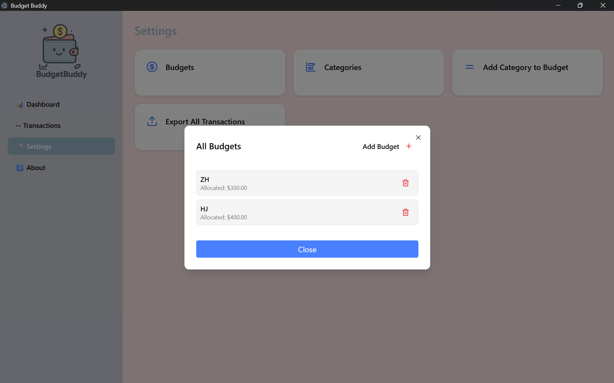
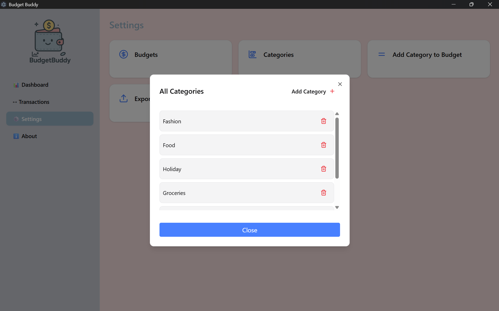
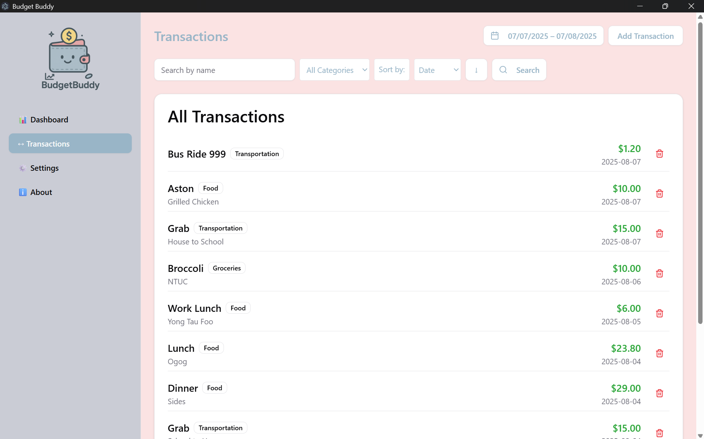
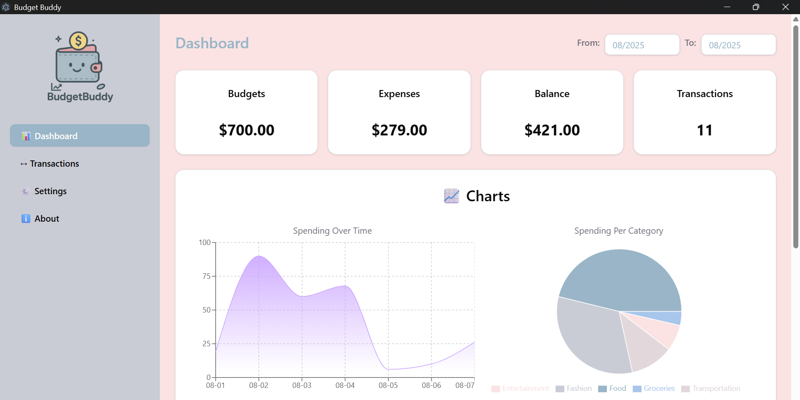
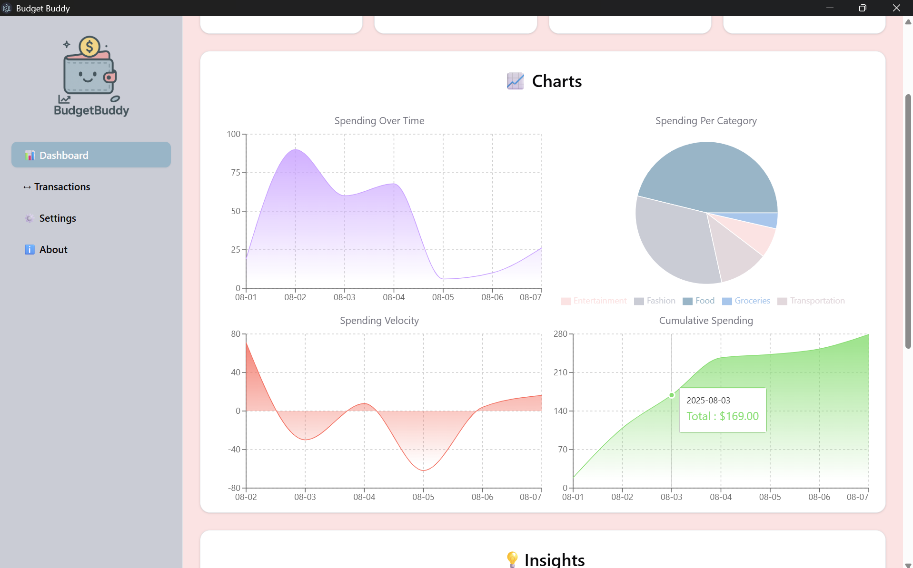
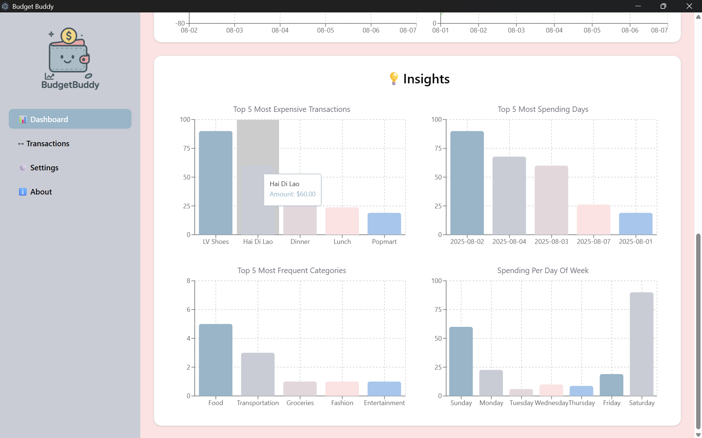
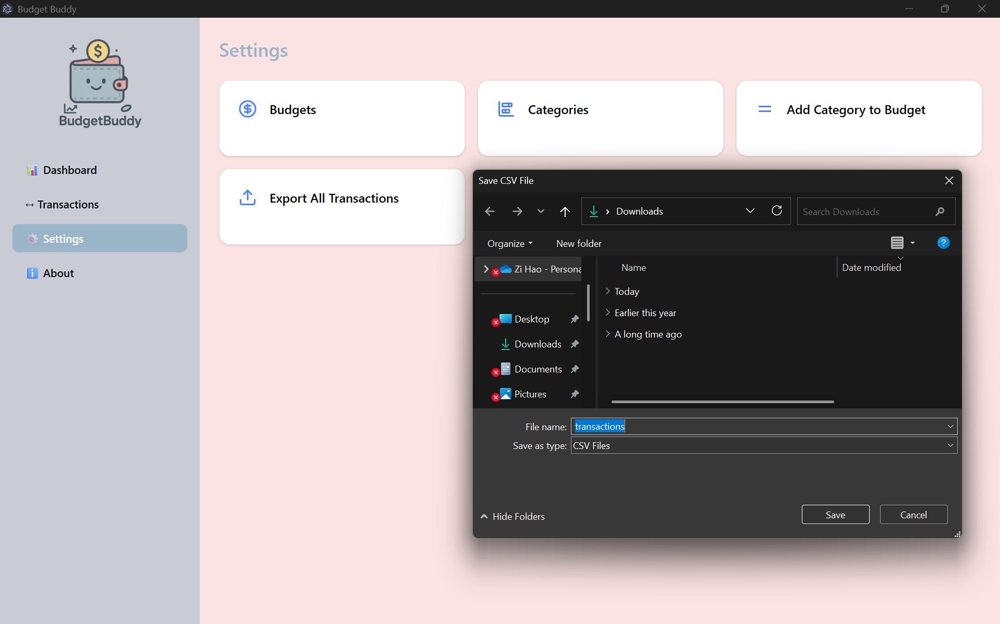
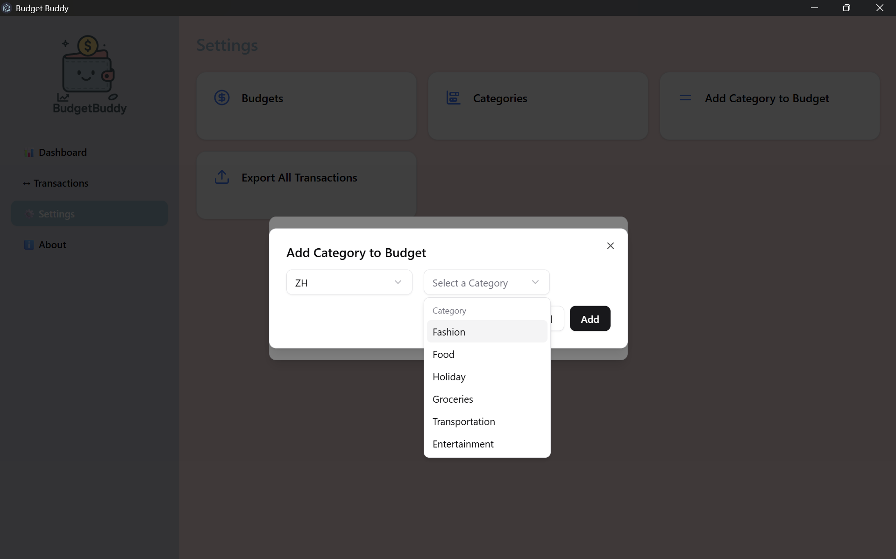

<h1 align="center">Budget-Buddy💸</h1>

## About:
Budget-Buddy is a desktop application designed for local expense tracking. It features interactive charts and visualisations to help users better understand and manage their finances. A full list of features that we provide are avaliable [here](#features).

## Technology and Tools:
[](https://www.typescriptlang.org/) 
[](https://tailwindcss.com/) 
[](https://react.dev/) 
[](https://www.electronjs.org/) 
[](https://www.sqlite.org/) 
[](https://redux.js.org/)


## Gallery:
<h3>Budget, Category and Transactions</h3>
<p align="left">
  
  
  
</p>

<h3>Dashboard</h3>
<p align="left">
  
  
  
</p>

<h3>Export and Linking</h3>
<p align="left">
  
  
</p>


## Running the Application:
### Prerequisites:
Make sure you have the following installed:
- Node.js (v18 or newer)
- npm (comes with Node.js)
### Setup Instructions:
```bash
# Clone the repository
git clone https://github.com/27July/budget-buddy.git
cd budget-buddy

# Install all dependencies (main + renderer)
npm install
cd renderer
npm install
cd ..

# Rebuild native modules (e.g. better-sqlite3)
npm run rebuild

# Start the development environment
npm run dev
```

## Features:
- Track total expenses, budgets, and balance
- Visualize spending with interactive charts
- Gain insights from transaction analytics
- Record and manage individual transactions
- Set budgets and organize spending by category
- Export transaction history for backup or analysis

## Made with ❤️ by [Wee Zi Hao](https://github.com/27July)
[](https://github.com/27July)
[](https://www.linkedin.com/in/wee-zi-hao)
[](mailto:weezihao@gmail.com)
[](https://27july.github.io/)
